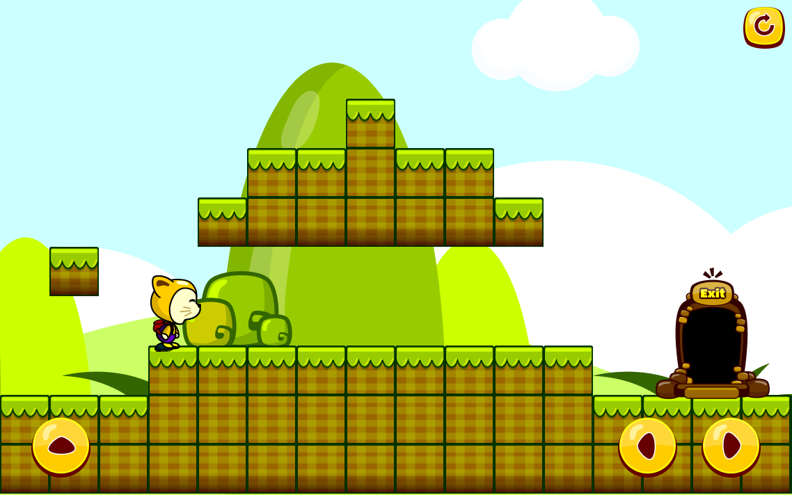
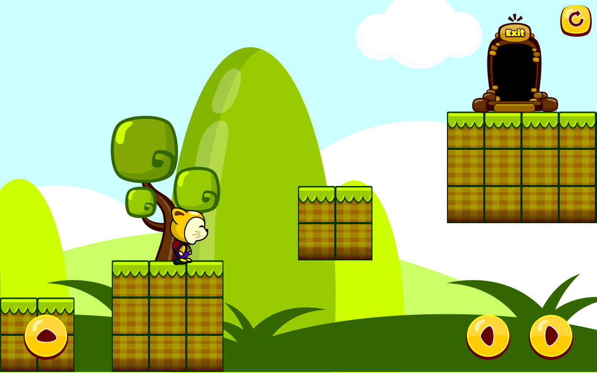
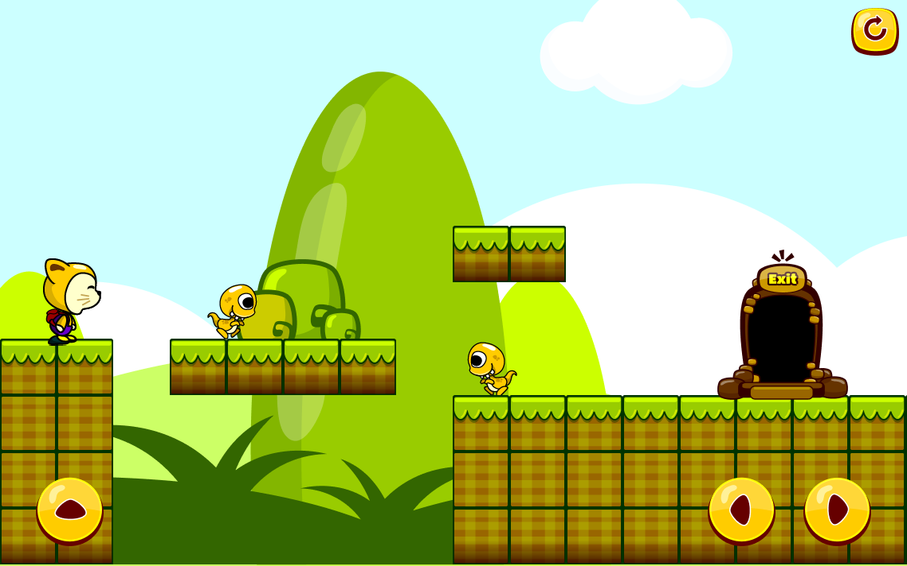

# Jeu de platforme
Petit jeu de platforme créé en typescript avec la bibliothèque [CreateJs](https://createjs.com/)
Le jeu a été développé pour le mobile et c'est pour la raison des boutons sur l'écran.

## Niveau 1

## Niveau 2

## Niveau 3

## Crédit

Les images ont été créés par Fikiri sur [graphicriver](https://graphicriver.net/) et les effets sonores ont été trouvé par plusieurs sources sur [opengameart](https://opengameart.org/)